# Benchmarking do mercado de oauth

## 1. Amazon Cognito

### 1.1. Cadastro de novo software

##### 1.1.1. Seleção de nome e tipo

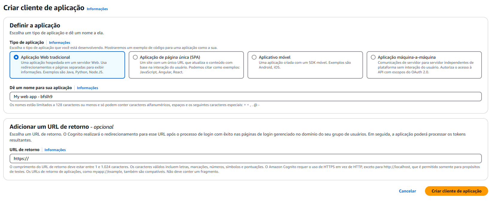

O cadastro de software tem somente essa tela, não havendo configurações adicionais durante a criação do cliente.

### 1.2. ClientSecret

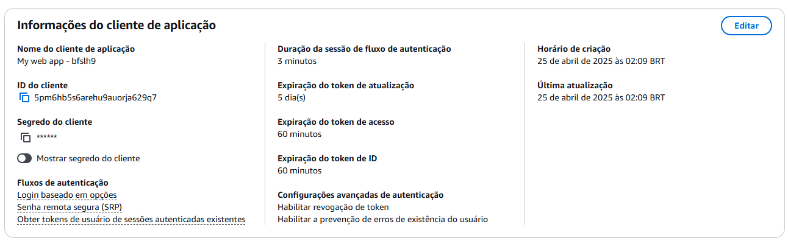

No caso do Amazon cognito, não é possível criar um clientSecret extra para uma aplicação. Os clientSecrets não tem data de expiração. É necessário criar uma nova aplicação para que possa ser rotacionado o secret, conforme indicado na documentação.

You can't change secrets after you create an app. You can create a new app with a new secret if you want to rotate the secret. You can also delete an app to block access from apps that use that app client ID.[^1]

### 1.3. Auditoria e Monitoramento

O Amazon Cognito não oferece serviço gratuito de monitoramento, mas eles possuem um Plano Plus onde os logs ficam disponíveis para usuários pagos.

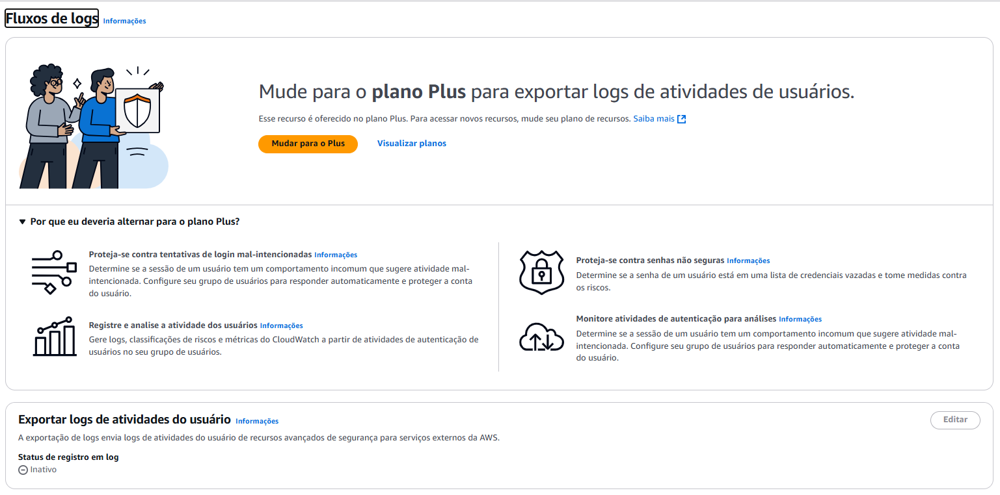

### 1.4. Comportamento de inatividade

Há uma recomendação pela exclusão de credenciais de usuário que estão em inatividade, mas não é indicado um período e não há nenhuma ação por parte da AWS em relação a exclusão do usuário, ficando essa decisão totalmente a cargo da aplicação.

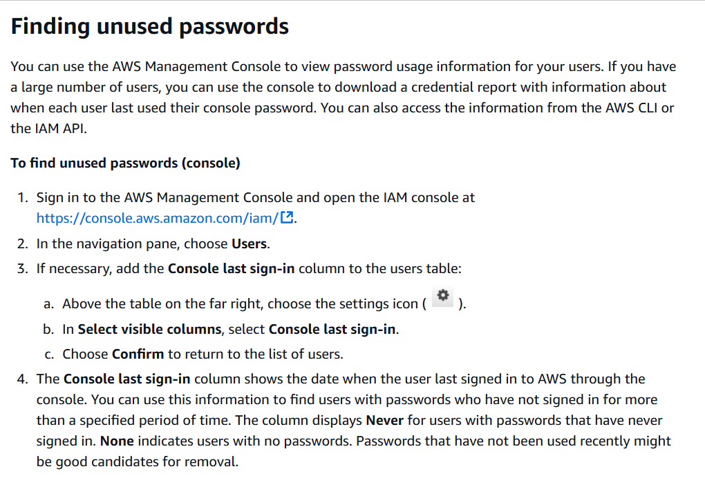

To increase the security of your AWS account, remove IAM user credentials (that is, passwords and access keys) that are not needed. For example, when users leave your organization or no longer need AWS access, find the credentials that they were using and ensure that they are no longer operational. Ideally, you delete credentials if they are no longer needed.[^9]

## 2. Oauth0

### 2.1. Cadastro de novo software

Durante o cadastro do software, há a seleção do nome da aplicação e é possível escolher o tipo de aplicação. Isso é relevante pois eles apresentam um tutorial conciso de utilização de acordo com a tecnologia a ser utilizada, facilitando a vida do desenvolvedor que deseja iniciar sua joranda com a ferramenta.

##### 2.1.1. Seleção de nome e tipo

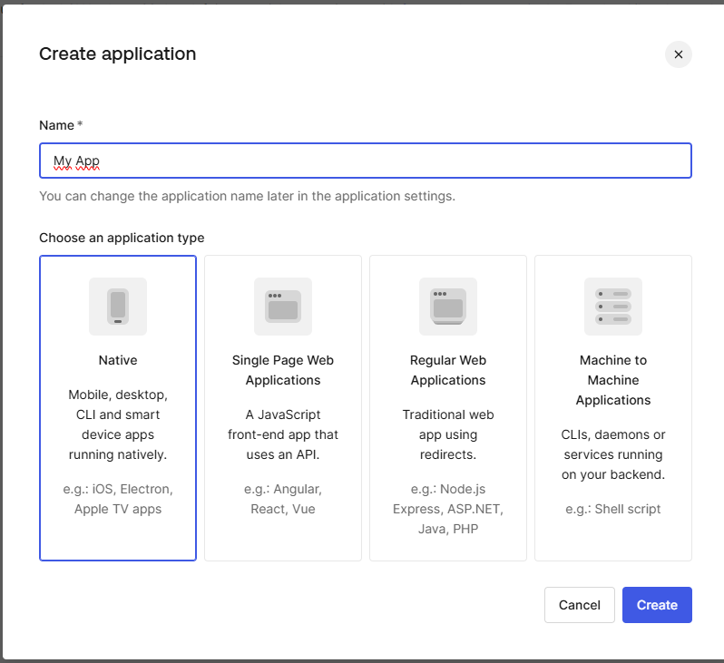

##### 2.1.2. Seleção de tecnologia

##### 2.1.3. Tutorial e samples na tecnologia

Ao criar uma aplicação e selecionar a linguagem, você é levado a um tutorial de como utilizar o oauth na sua aplicação, com snippets de código e passo-a-passo.

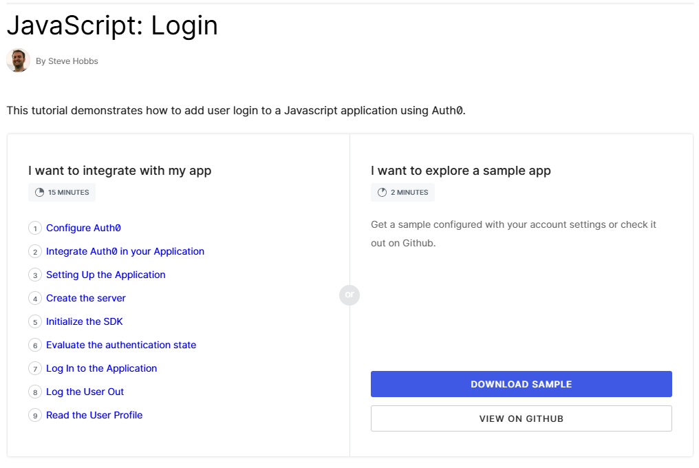

### 2.2. ClientSecret

A aplicação contém um clientSecret único, que pode ser visualizado na tela inicial da aplicação

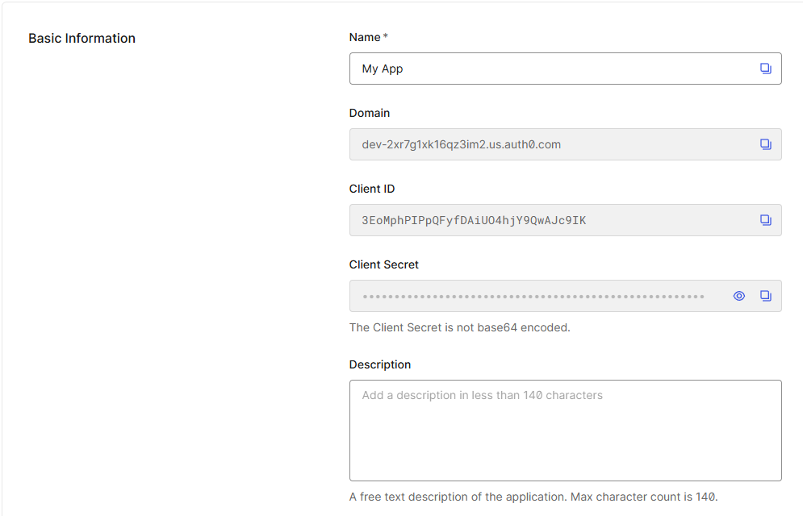

##### 2.2.1. Rotação de ClientSecret

É possível alterar um clienteSecret, não sendo possível manter a utilização do clientSecret antigo após a rotação.

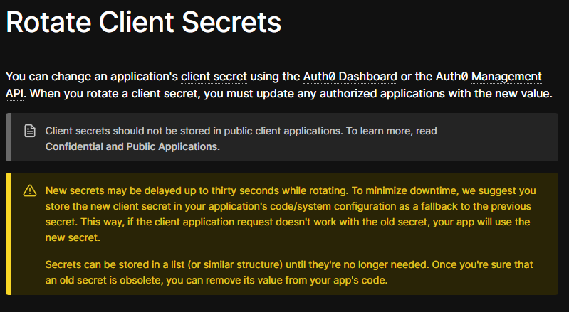

Eles possuem uma área de rotação dentro da página do aplicativo. Está dentro de uma "área de perigo" indicando o risco ao se utilizar a área sem conhecimento do que está fazendo. Isso ajuda o usuário a se atentar para não rotacionar o ClientSecret por acidente.

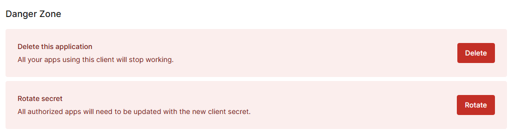

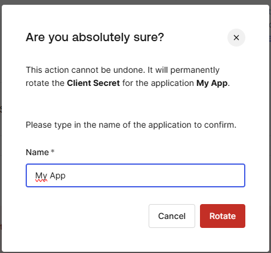

##### 2.2.2. Rotação de ClientSecret via API

Além disso é possível rotacionar o secret via API, tornando mais fácil que as empresas possam implementar uma rotação a cada determinado período de forma automatizada

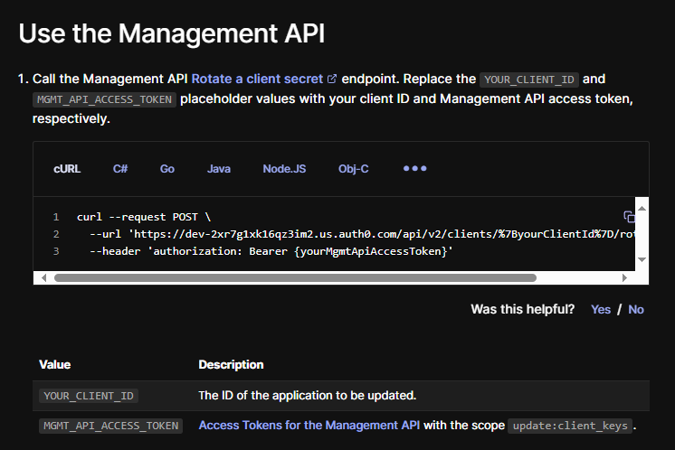

##### 2.2.3. Criação de secrets personalizados

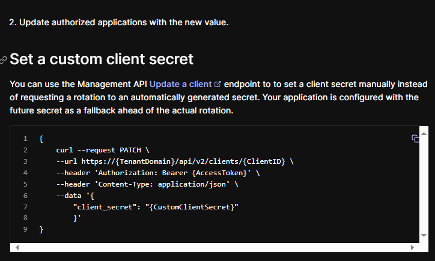

Não há expiração de clientSecrets

### 2.3. Auditoria e Monitoramento

##### 2.3.1. Paínel de logs

Há um paínel de logs para consulta de logs da aplicação, sendo possível verificar todas as operações feitas tanto na plataforma do aplicativo como geração de tokens.

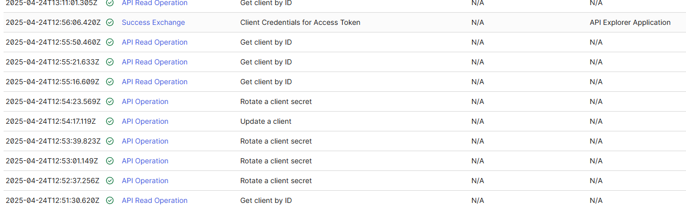

### 2.4. Comportamento de inatividade

Foram pesquisados os seguintes termos e não foi localizada nenhuma informação em relação ao inatividade.

[Auth0 Docs](https://auth0.com/docs)

* Inactivity
* Suspension
* Lifecycle
* Cleanup
* Expiry

Durante a pesquisa foi encontrado essa forma de o cliente conseguir fazer a deleção após tempo de inatividade

[Deleting Inactive Users in Auth0 with Okta Workflows – IAMSE](https://iamse.blog/2024/05/01/deleting-inactive-users-in-auth0-with-okta-workflows/)

## 3. Okta

### 3.1. Cadastro de novo software

##### 3.1.1. Seleção de tipo de sign-in e tipo de aplicação

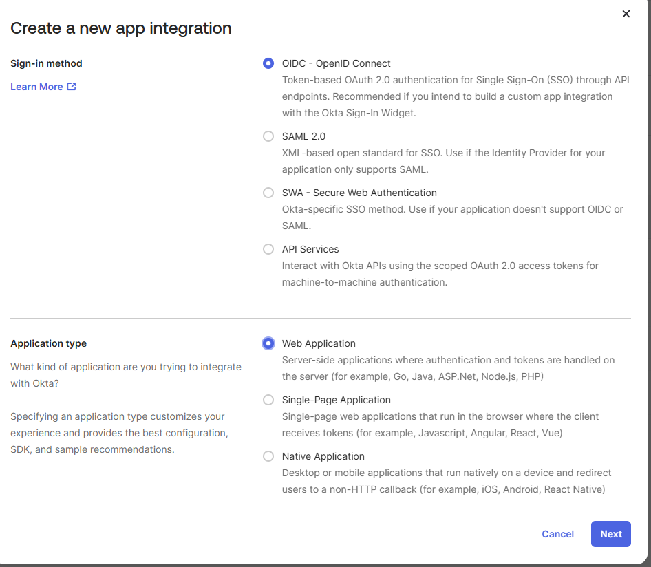

##### 3.1.2. Escolha do nome da aplicação e configuração dos grantType permitidos

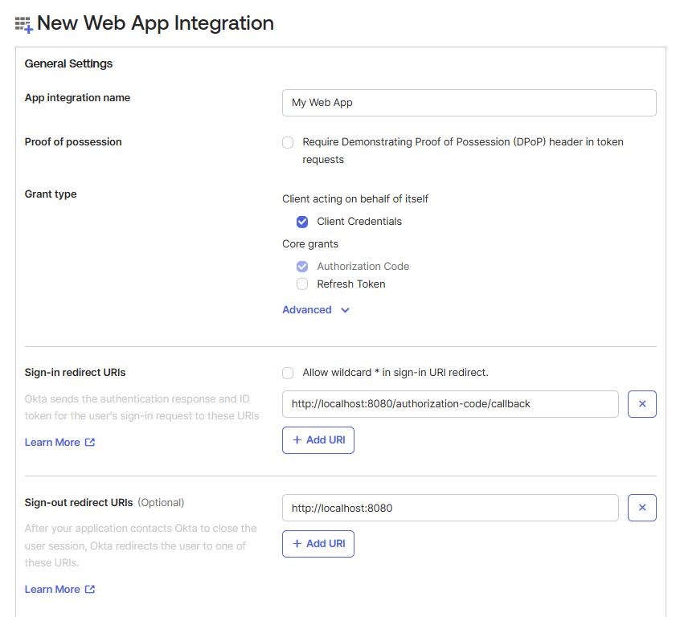

### 3.2. ClientSecret

##### 3.2.1. É possível utilizar tanto o clientSecret como par de chaves para a autenticação via client credentials

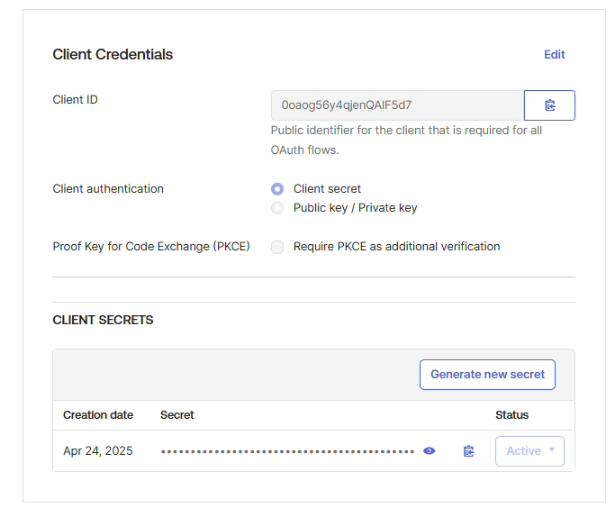

##### 3.2.2. É possível gerar um novo secret

É possível gerar somente dois secrets simultâneos, sendo possível inativar e excluir um secret antigo.

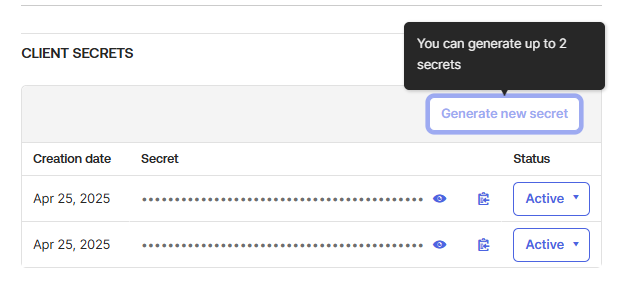

##### 3.2.3. Alteração períodica de secret

É encorajado ao usuário a alteração do clientSecret periodicamente mas não é uma política enforced

"Just like periodically changing passwords, regularly rotating the client secret that your app uses to authenticate is a security best practice"[^2]

Requerimento de política definida para utilização

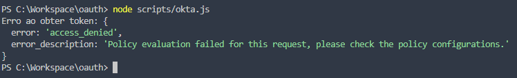

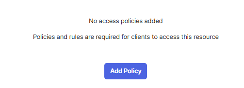

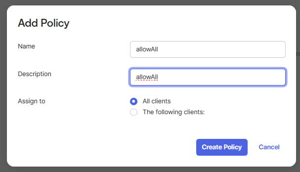

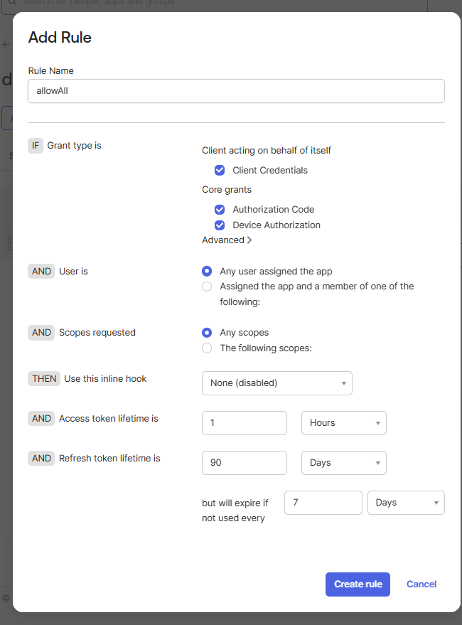

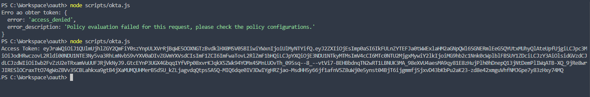

### 3.3. Auditoria e Monitoramento

##### 3.3.1. Sistema de busca de logs

É possível fazer pesquisas de log de maneiras diversas, permitindo uma autonomia de busca do cliente, sendo possível mapear de maneira completa a aplicação.

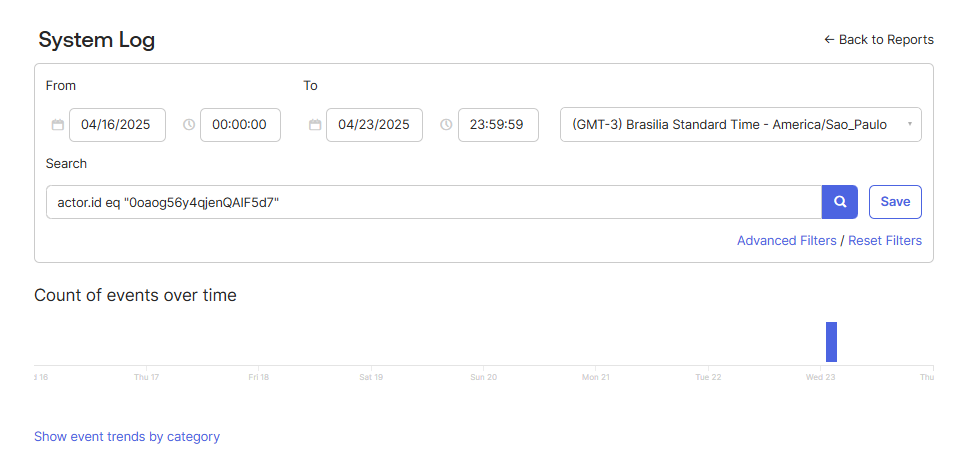

##### 3.3.2. Download de logs

É permitido o download do csv dos logs (não foi estressado os limites desse download) que permite que o cliente investigue incidentes.

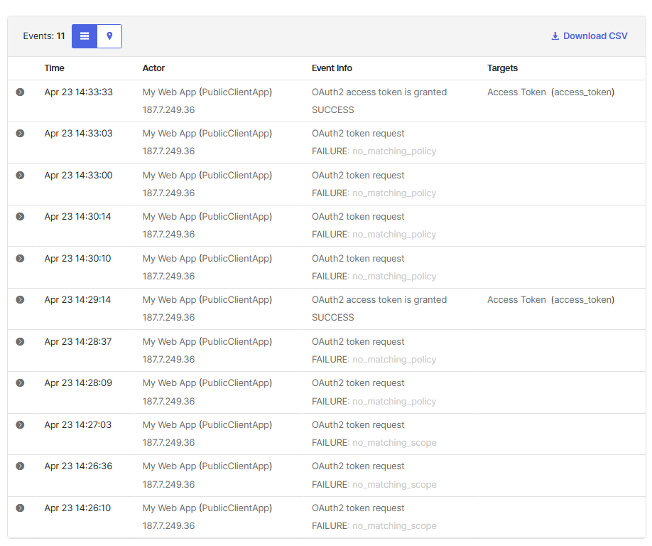

##### 3.3.3. Exemplo de filtro por erros, onde o cliente consegue se informar a motivação dos erros ocorridos.

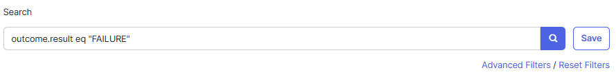

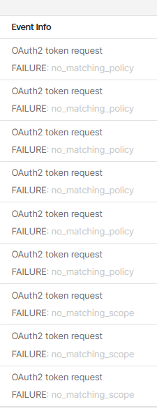

### 3.4. Comportamento de inatividade

Não foi encontrado na documentação nenhum comportamento em caso de inatividade da aplicação. No suporte deles, um usuário perguntou como faria o gerenciamento das aplicações não usadas mas ativas e foi sugerido a utilizar o monitoramento deles para verificar as aplicações usadas nos últimos 90 dias.

[to cleanup/manage the amount of unused but active Okta applications in our tenant](https://support.okta.com/help/s/question/0D54z0000ABw3B6CQJ/need-to-cleanupmanage-the-amount-of-unused-but-active-okta-applications-in-our-tenant?language=en_US)

[Application Usage report | Okta Classic Engine](https://help.okta.com/en-us/content/topics/reports/app-usage-report.htm)

## 4. PingIdentity

### 4.1. Cadastro de novo software

##### 4.1.1. Escolha do tipo de registração

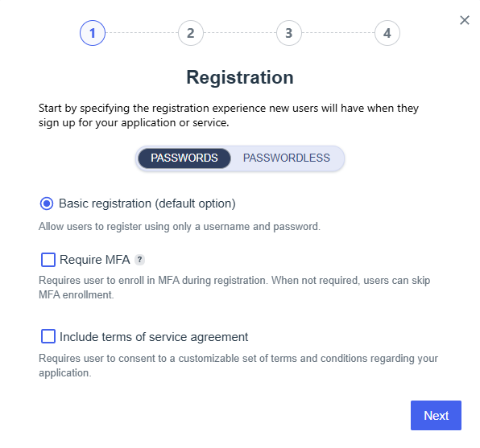

##### 4.1.2. Escolha do tipo de autenticação do cliente.

No registro de um novo aplicativo, eles permitem a escolha pelo cliente pela optação do MFA ou não

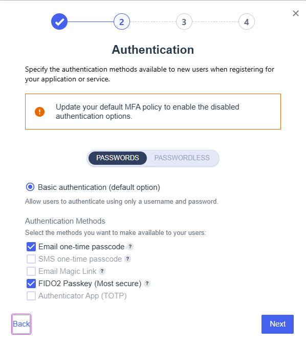

##### 4.1.3. Escolha do gerencimento de perfil

O cliente pode decidir com que tipo de dados o cliente pode interagir

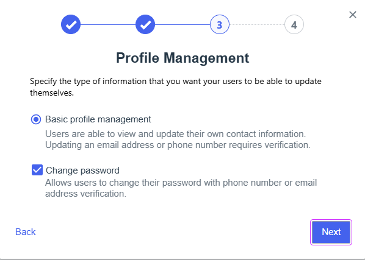

##### 4.1.4. O cliente pode escolher a forma como o usuário vai recuperar contas

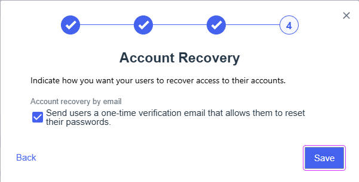

#### 4.1.5. Aplicação Exemplo

O usuário tem um "playground" para verificar o comportamento do fluxo de autorização em uma aplicação exemplo.

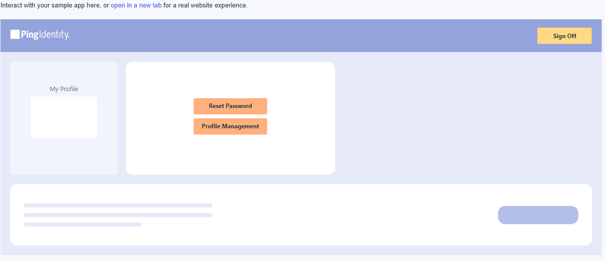

### 4.2. ClientSecret

##### 4.2.1. Tela de ClientSecret

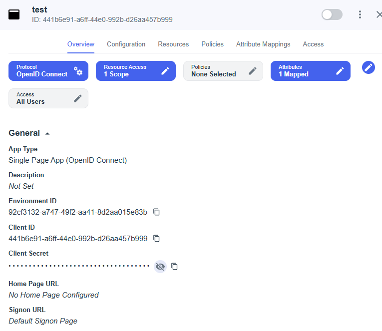

##### 4.2.2. Geração de novo ClienteSecret

É possível gerar um novo secret mantendo a compatibilidade com o antigo

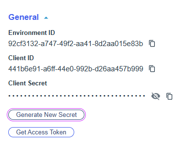

Na geração de um novo clientSecret, o cliente pode selecionar o período em que o clientSecret anterior permanecerá válido, permitindo que a rotação do clientSecret seja um processo sem atrito.

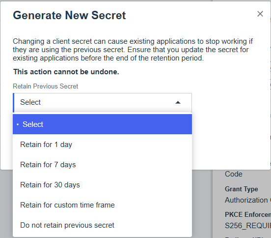

Não há menção a expiração de client_secret (nem após inatividade nem período padrão) indicando que não há expiração definida.

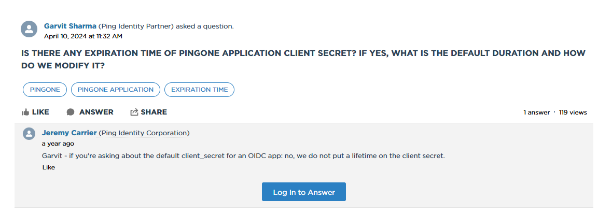

Há uso de urls próprias a cada cliente

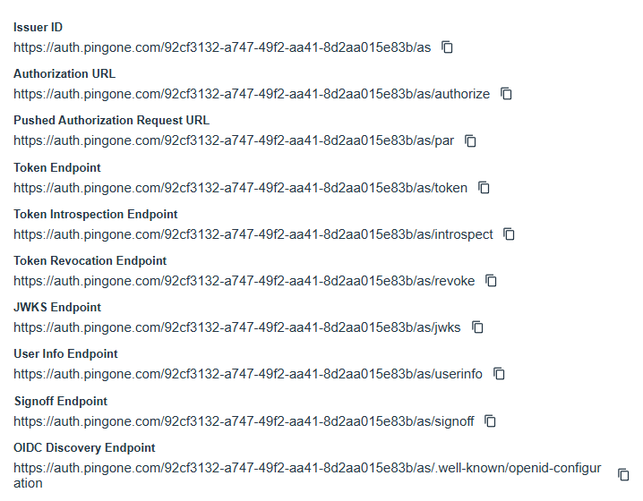

### 4.3. Auditoria e Monitoramento

Ele traz a informação de quem leu o secret, em que horário

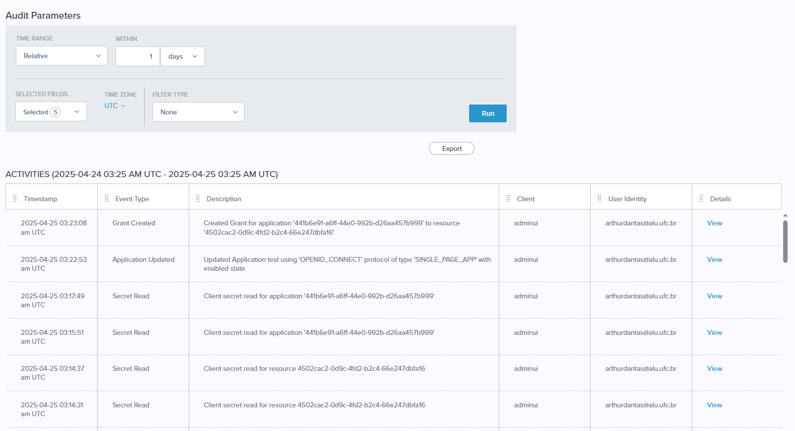

Com o seguinte detalhamento

> {
> "_links":{
> "self":{
> "href":"https://api.pingone.com/v1/environments/92cf3132-a747-49f2-aa41-8d2aa015e83b/activities/97aae040-9202-4a6f-8c35-32263beab9d6"
> }
> },
> "id":"97aae040-9202-4a6f-8c35-32263beab9d6",
> "recordedAt":"2025-04-25T03:23:08.954Z",
> "createdAt":"2025-04-25T03:23:08.967Z",
> "correlationId":"3361e383-15d2-4a59-ac4f-8ec3da8c026e",
> "internalCorrelation":{
> "sessionId":"9ff66108-5aca-4a45-8984-e56b1a259fd2"
> },
> "actors":{
> "client":{
> "id":"adminui",
> "name":"adminui",
> "type":"CLIENT"
> },
> "user":{
> "id":"1de50343-cd6c-4828-bd74-e3093a665b33",
> "name":"arthurdantas@alu.ufc.br",
> "environment":{
> "id":"0834ff36-7f1f-4ac1-8c73-df2d0b697a0a"
> },
> "population":{
> "id":"2157fba2-1ad2-4d1c-b332-61ecb386617b"
> },
> "href":"https://api.pingone.com/v1/environments/0834ff36-7f1f-4ac1-8c73-df2d0b697a0a/users/1de50343-cd6c-4828-bd74-e3093a665b33",
> "type":"USER"
> }
> },
> "source":{
> "userAgent":"Mozilla/5.0 (Windows NT 10.0; Win64; x64) AppleWebKit/537.36 (KHTML, like Gecko) Chrome/135.0.0.0 Safari/537.36 Edg/135.0.0.0",
> "ipAddress":"2804:d59:896b:4100:85d:2b15:ba0d:46c4"
> },
> "action":{
> "type":"GRANT.CREATED",
> "description":"Grant Created"
> },
> "resources":[
> {
> "type":"APPLICATION",
> "id":"441b6e91-a6ff-44e0-992b-d26aa457b999",
> "name":"test",
> "environment":{
> "id":"92cf3132-a747-49f2-aa41-8d2aa015e83b"
> },
> "href":"https://api.pingone.com/v1/environments/92cf3132-a747-49f2-aa41-8d2aa015e83b/applications/441b6e91-a6ff-44e0-992b-d26aa457b999"
> }
> ],
> "result":{
> "status":"SUCCESS",
> "description":"Created Grant for application '441b6e91-a6ff-44e0-992b-d26aa457b999' to resource '4502cac2-0d9c-4fd2-b2c4-66e247dbfa16'"
> }
> }

É possível criar recursos personalizados (e consequentemente escopos personalizados). 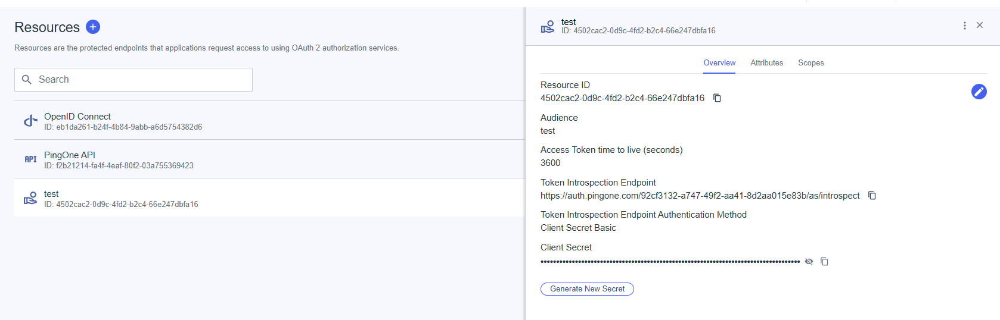

É possível criar alertas

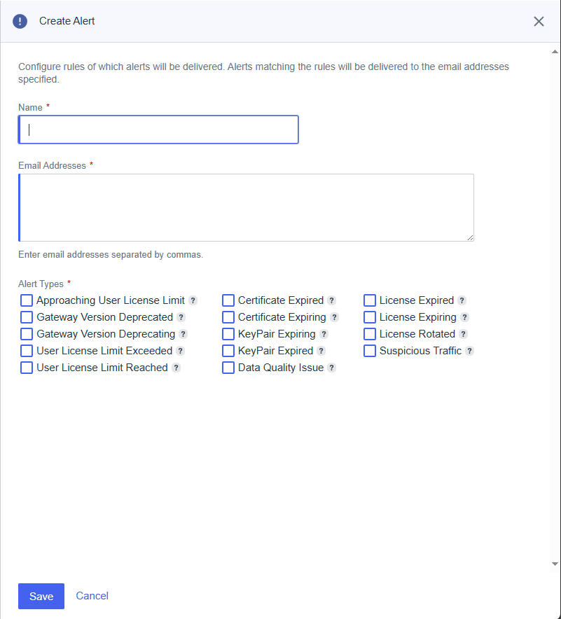

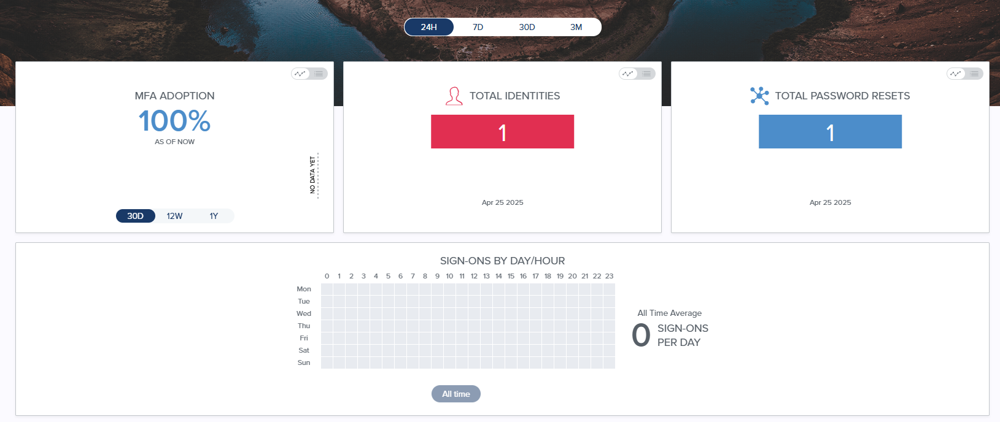

## 4.4. Comportamento de inatividade

Foram pesquisados os seguintes termos e não foi localizada nenhuma informação em relação ao inatividade.

[PingOne Platform API Reference](https://apidocs.pingidentity.com/pingone/platform/v1/api/#credential-types)

* Inactivity
* Suspension
* Lifecycle
* Cleanup
* Expiry

É possível verificar o momento do último login, sendo isso insumo para a inativação de aplicativo em inatividade [ds-last-login-time | PingDS](https://docs.pingidentity.com/pingds/7.2/schemaref/at-ds-last-login-time.html).

## 5. Microsoft Entra

Para criação de conta de uso no Microsoft Entra, é necessário associar um CNPJ ou que o administrador já em posse de um CNPJ associe.[^3] Portanto, nesse caso específico, os dados colhidos foram feitos com base somente em documentação.

### 5.1. Cadastro de novo software

### 5.2. ClientSecret

"You can associate only one client ID with your add-in, but you can associate multiple client secrets with a client ID. For security and administrative purposes, we recommend limiting the number of client secrets associated with a client ID."[^4]

"Choose how long your client secret is valid for. The options are one, two, or three years. We recommend choosing one year, because it might be easier to track within your business processes than longer time periods. But there's no security implication to choosing two or three years. When the client secret is expiring, you need to update your add-in."[^5]

É possível cadastrar um novo client secret simultaneamente ao atual. Eles trazem as situações onde isso é recomendado. Não há nenhuma menção a inativação automática de software em inatividade.[^6]

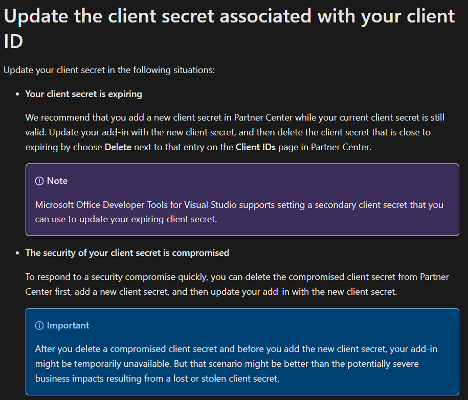

### 5.3. Auditoria e Monitoramento

São salvos logs durante o período de 30 dias e é possível utilizar o sistema de notificações e alertas para ter uma visão ampla de como está a saúde da aplicação [^7]

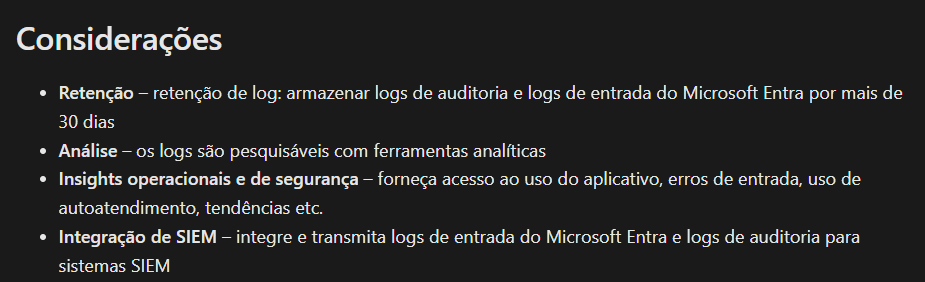

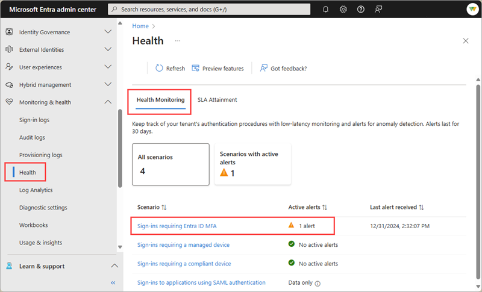

### 5.4. Comportamento de inatividade

Após período de 90 dias sem criação de token, é feita uma recomendação para a inativação do aplicativo.

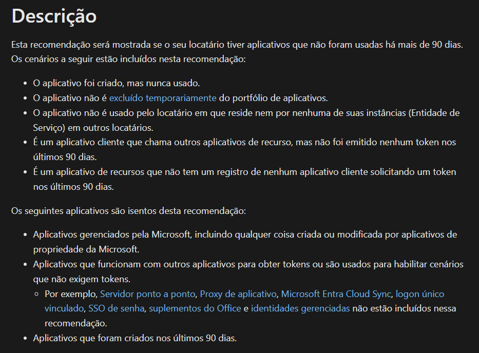

## 6. Google Cloud

### 6.1. Cadastro de novo software

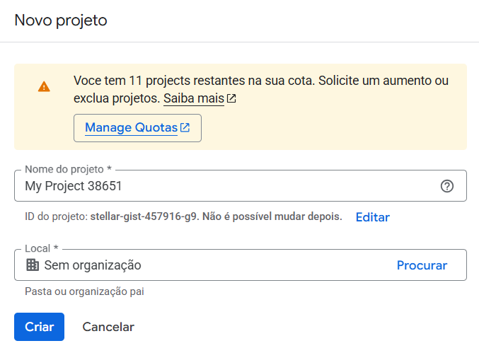

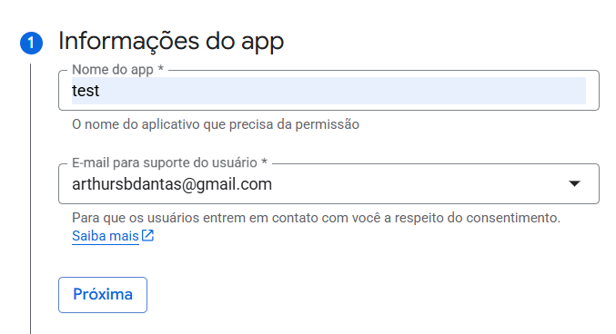

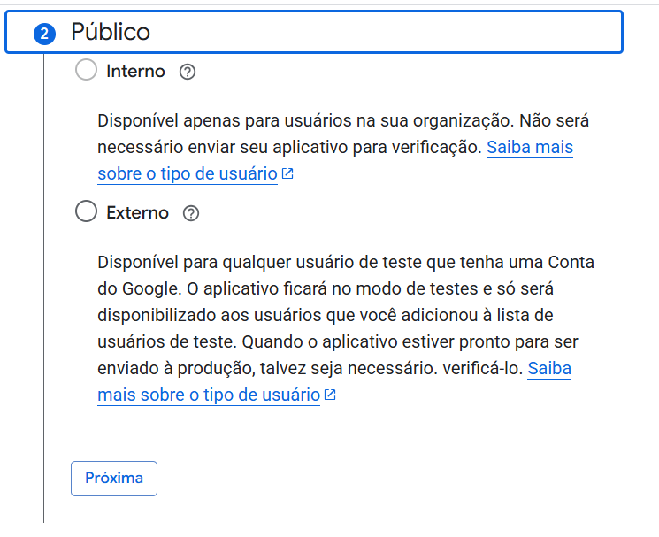

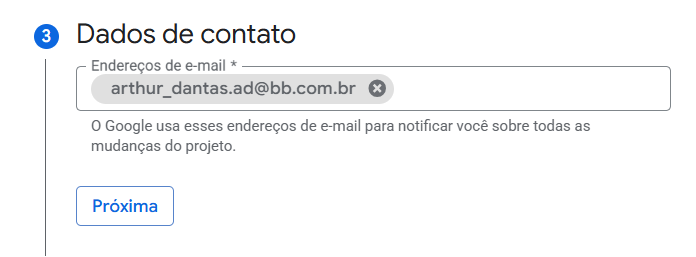

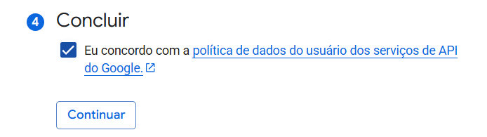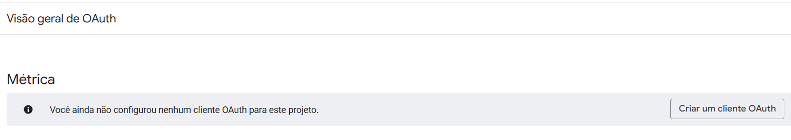


### 6.2. ClientSecret

##### 6.2.1. Rotação de ClientSecret


##### 6.2.2. Desativação de secret


##### 6.2.3. Exclusão de secret


### 6.3. Auditoria e Monitoramento

O google api não conta com logs para auditoria mas possui um dashboard para uma visão ampla da utilização da aplicação.


### 6.4. Comportamento de inatividade

[^8]A notificação de não uso da aplicação se dá após 90 dias sem nenhum acionamento de autenticação.


## 7. Usuário Impessoal

**usuários são bloqueados após x tempo sem uso?**

Não há instrução normativa para isso, apenas os casos listados na IN423

2.2.7.1.1 O Código de Usuário também pode ser excluído por inatividade de acordo com os seguintes prazos:

2.2.7.1.1.1 "Z": após 365 dias;

2.2.7.1.1.2 "T": após 60 dias;

2.2.7.1.1.3 "C": após 60 dias;

2.2.7.1.1.4 "E": após 60 dias;

2.2.7.1.1.5 "A": após 60 dias.

2.2.7.1.2 A exclusão por inatividade não se aplica aos usuários do tipo F.

**atualmente é possível gerar mais de uma senha para um mesmo usuário impessoal?**

Simultaneamente não é possível. Mas existe o cofre de senhas que tem modos de gestão ativa de senha, trocando a mesma a cada operação.

**os usuários são notificados da necessidade de alterar e como (email, etc)?**

o custodiante do usuário impessoal é responsável direto pela sua manutenção de senha. Na sua ausência, um novo custodiante é atribuído ao usuário. Em casos excepcionais, a equipe USD/IAM/Acessos Críticos avoca a permissão e realiza a manutenção desejada, mas isso tem normativo e ocorre apenas em casos bem definidiso.

**há algum acompanhamento de quanto tempo um usuário impessoal está sem uso?**

há ações em andamento para a identificação de consumo deste usuário, no entanto, o melhor acompanhamento é no log de usabilidade da autenticação.

**há um acompanhamento de quais usuários acessaram tal recurso através de um usuário impessoal?**

A definição de usabilidade do usuário está direcionado ao ambiente que ele está autorizado a ser utilizado. Por exemplo, um usuário impessoal do DB2-D3G4 só conseguirá se conectar em um SGBD DB2 e na instância D3G4, caso ele tente acessar um recurso de um Mainframe ele não será reconhecido, pois há processos que aderem o sistema ACESSO e replicam os usuários para o ambiente, e juntamente com o método de autorização RBAC do ACESSO ele fecha a autenticação e a autorização do usuário nos recurosos desse ambiente.

## 8. Citibank

### 8.1. Cadastro de novo software

O cadastro de novo software é somente uma tela.


### 8.2. ClientSecret


## 9. OCBC Bank

### 9.1. Cadastro de novo software


### 9.2. ClientSecret


Não há limitações para visualização do ClientSecret, não há sequer um


## 10. National Bank of Greece

## 11. Deutsche Bank


## 12. Nordea

### 12.1. Cadastro de novo software


### 12.2. ClientSecret

If the Client Secret is lost or leaked, it can be regenerated by clicking the reset button on the apps page.

**Client secret is lost** If you lose the client secret, you must generate a new one in the developer portal.

[Nordea | Open Banking Developer Portal](https://developer.nordeaopenbanking.com/documentation?api=Authentication%20API)

Ao atualizar, já não é possível ver o clienSecret

### API Console


## 13. ANB-Amro

## 14. SEB


A clientSecret é de visualização única


Não dá para criar outra clientSecret

Não há informações sobre quando a clientSecret expira

## 15. BBVA


Não pode criar conta imediatamente

## 16. Mercado Pago

### 16.1. Cadastro de novo software


É necessário escolher o nome da aplicação, o tipo de integração e o produto a ser integrado.


### 16.2. ClientSecret

é possível visualizar o clientSecret mais de uma vez


Atualizando a página, ainda é possível observar o clientSecret, sendo assim, não é de visualização única


É possível renovar chave


é possível selecionar quando a chave atual expira


não foi verificado nenhuma informação sobre a expiração após tempo de inatividade.

## 17. Itau

1.1. Cadastro de novo software


O Itaú não permite a criação de uma aplicação própria e somente testes dentro do sandbox a partir de uma credencial gerada e utilizavel somente naquele contexto.

## 18. Banco Original


Não permite o cadastro de conta de maneira imediata.

## 19. Pag Seguro


Necessário envio dos documentos

## 20. Sicoob


Para criar a aplicação é necessário a criação de um usuário em outro app e de uma cooperativa

## 21. Santander


Para criar uma aplicação é necessário estar associado com um parceiro

## 22. Consolidação

| pergunta                                                                                     |       oauth0       |        okta        |    PingIdentity    |   Amazon Cognito   | Microsoft Entra | Google | usuário impessoal BB | citibank* |
| -------------------------------------------------------------------------------------------- | :----------------: | :----------------: | :----------------: | :----------------: | :-------------: | :-----: | :-------------------: | --------- |
| é possível alterar o clientSecret da aplicação (sem criar uma aplicação nova)?         |        sim        |        sim        |        sim        |        não        |       sim       |   sim   |          n/a          | não      |
| é possível manter dois clientSecrets funcionando simultaneamente?                          |        não        |        sim        |        sim        |        não        |       sim       |   sim   |         não         | não      |
| é possível configurar um tempo de expiração para o clientSecret na criação de um novo? |        n/a        |        sim        |        sim        |        n/a        |      não      |  não  |         não         | não      |
| os clientSecrets tem um tempo de expiração inerente                                        |        não        |        não        |        não        |        não        |       sim       |  não  |         não         | não      |
| cada aplicação tem um url distinta para acionar as apis?                                   |        sim        |        sim        |        sim        |        sim        |        ?        |  não  |          n/a          | não      |
| conta com logs?                                                                              |        sim        |        sim        |        sim        |        sim*        |       sim       |  sim*  |          sim          | não      |
| expiração de usuários                                                                     |        não        |        não        |        não        |        não        |      não      |  não  |    60 ou 365 dias    | não      |
| notificação em caso de não-acionamento da api por conta de acesso                         | insumos fornecidos | insumos fornecidos | insumos fornecidos | insumos fornecidos |     90 dias     | 90 dias |  insumos fornecidos  | não      |
| é possível visualizar as credenciais após criadas?                                        |        sim        |        sim        |        sim        |        sim        |       sim       |   sim   |          n/a          | não      |

*é uma parte paga da ferramenta
Nos casos onde os insumos são fornecidos, não é feita uma notificação direta ao usuário mas ele tem acesso a informações que permitam ações em relação ao uso de sua aplicação.

22.1. Rotação de ClientSecrets

* Desenvolver recomendações claras e acessíveis para clientes sobre a importância da rotação periódica de clientSecrets.
* Implementar um sistema de alertas que notifique clientes sobre períodos recomendáveis para rotação e inativação, por exemplo após período em inatividade.
* Verificar a possibilidade de o cliente configurar um período para inativação após período em inatividade, similar aos workflows do oauth0 (seção 2.4), por exemplo.

22.2. Logs e Auditoria

* Avaliar a viabilidade da implementação de um sistema de logs semelhante ao do Okta (presente na seção 3.3 do estudo).
* Explorar formatos padronizados de logs para facilitar auditorias e análises de segurança.
* Verificar a viabilidade de um dashboard de visualização geral dos dados pelo cliente.

22.3. URLs Distintas para Aplicações

* Isolamento de aplicações: Cada aplicação tem seu próprio endpoint, reduzindo o risco de acessos indevidos e garantindo que credenciais e tokens sejam vinculados apenas à aplicação correta.
* Facilidade de aplicação de políticas de segurança: Permite configurar regras específicas para cada aplicação, como autenticação multifator, listas de controle de acesso (ACL) e auditoria de logs.

## 23. Links Utilizados

[^1]: [Application-specific settings with app clients - Amazon Cognito](https://docs.aws.amazon.com/cognito/latest/developerguide/user-pool-settings-client-apps.html)
    
[^2]: [Client secret rotation and key management | Okta Developer](https://developer.okta.com/docs/guides/client-secret-rotation-key/main/)
    
[^3]: [Criar um locatário de desenvolvedor gratuito do Microsoft Entra - Microsoft Entra Verified ID | Microsoft Learn](https://learn.microsoft.com/pt-br/entra/verified-id/how-to-create-a-free-developer-account)
    
[^4]: [Create or Update Client IDs and Secrets in Partner Center - Marketplace publisher | Microsoft Learn](https://learn.microsoft.com/en-us/partner-center/marketplace-offers/create-or-update-client-ids-and-secrets)
    
[^5]: [Create or Update Client IDs and Secrets in Partner Center - Marketplace publisher | Microsoft Learn](https://learn.microsoft.com/en-us/partner-center/marketplace-offers/create-or-update-client-ids-and-secrets)
    
[^6]: [Recomendação para remover aplicativos não utilizados - Microsoft Entra ID | Microsoft Learn](https://learn.microsoft.com/pt-br/entra/identity/monitoring-health/recommendation-remove-unused-apps?tabs=microsoft-entra-admin-center)
    
[^7]: [Como configurar notificações por e-mail de Saúde (prévia) - Microsoft Entra ID | Microsoft Learn](https://learn.microsoft.com/pt-br/entra/identity/monitoring-health/howto-configure-health-alert-emails?tabs=microsoft-entra-admin-center)
    
[^8]: [Informações gerais sobre as contas de serviço  |  IAM Documentation  |  Google Cloud](https://cloud.google.com/iam/docs/service-account-overview?hl=pt-br)
    
[^9]: [Find unused AWS credentials - AWS Identity and Access Management](https://docs.aws.amazon.com/IAM/latest/UserGuide/id_credentials_finding-unused.html)
    
[^10]: [OAuth log events - Cloud Identity Help](https://support.google.com/cloudidentity/answer/6124308?hl=en)
