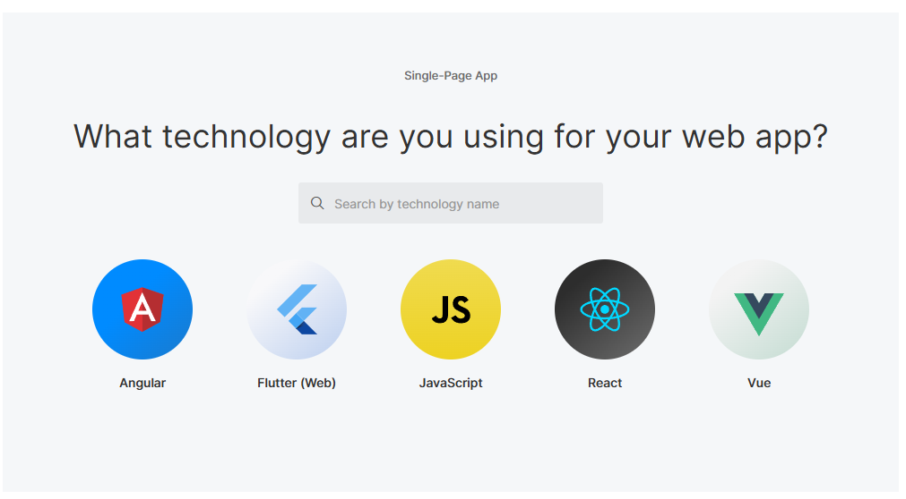

# Benchmarking do mercado de oauth

## Amazon Incognito

### Cadastro de novo software

O cadastro de software tem somente essa tela

### ClientSecret

You can't change secrets after you create an app. You can create a new app with a new secret if you want to rotate the secret. You can also delete an app to block access from apps that use that app client ID.

[Application-specific settings with app clients - Amazon Cognito](https://docs.aws.amazon.com/cognito/latest/developerguide/user-pool-settings-client-apps.html)

## Oauth0

### Cadastro de novo software

Ao criar uma aplicação e selecionar a linguagem, você é levado a um tutorial de como implementar

### ClientSecret

A aplicação contém um cliente secret

Além disso é possível rotacionar o secret via API, tornando mais fácil que as empresas possam implementar uma rotação a cada determinado período de forma automatizada

Além disso, é possível criar um secret

Os clientSecrets não expiram

### Auditoria e Monitoramento

Há um paínel de logs para consulta

## Okta

### Cadastro de novo software

### ClientSecret

É possível gerar um novo secret

É encorajado ao usuário a alteração do clientSecret periodicamente mas não é enforced "Just like periodically changing passwords, regularly rotating the client secret that your app uses to authenticate is a security best practice"

[Client secret rotation and key management | Okta Developer](https://developer.okta.com/docs/guides/client-secret-rotation-key/main/)

Utilizando

### Auditoria e Monitoramento

É possível filtrar por erros e baixar o csv

## PingIdentity

### Cadastro de novo software

No registro de um novo aplicativo, eles permitem a escolha pelo cliente pela optação do MFA ou não

É possível interagir com uma aplicação exemplo

### ClientSecret

A aplicação contém um clientSecret associado

É possível gerar um novo secret mantendo a compatibilidade com o antigo

Sendo possível selecionar o período onde os dois secrets vão funcionar

possível gerar novo secret para uma aplicação existente

Não há menção a expiração de client_secret (nem após desuso nem período padrão)

O secret não expira após certo tempo em desuso

É possível manter dois simultâneos

### Auditoria e Monitoramento

Ele traz a informação de quem leu o secret, em que horário

Com o seguinte detalhamento

> {
> "_links":{
> "self":{
> "href":"https://api.pingone.com/v1/environments/92cf3132-a747-49f2-aa41-8d2aa015e83b/activities/97aae040-9202-4a6f-8c35-32263beab9d6"
> }
> },
> "id":"97aae040-9202-4a6f-8c35-32263beab9d6",
> "recordedAt":"2025-04-25T03:23:08.954Z",
> "createdAt":"2025-04-25T03:23:08.967Z",
> "correlationId":"3361e383-15d2-4a59-ac4f-8ec3da8c026e",
> "internalCorrelation":{
> "sessionId":"9ff66108-5aca-4a45-8984-e56b1a259fd2"
> },
> "actors":{
> "client":{
> "id":"adminui",
> "name":"adminui",
> "type":"CLIENT"
> },
> "user":{
> "id":"1de50343-cd6c-4828-bd74-e3093a665b33",
> "name":"arthurdantas@alu.ufc.br",
> "environment":{
> "id":"0834ff36-7f1f-4ac1-8c73-df2d0b697a0a"
> },
> "population":{
> "id":"2157fba2-1ad2-4d1c-b332-61ecb386617b"
> },
> "href":"https://api.pingone.com/v1/environments/0834ff36-7f1f-4ac1-8c73-df2d0b697a0a/users/1de50343-cd6c-4828-bd74-e3093a665b33",
> "type":"USER"
> }
> },
> "source":{
> "userAgent":"Mozilla/5.0 (Windows NT 10.0; Win64; x64) AppleWebKit/537.36 (KHTML, like Gecko) Chrome/135.0.0.0 Safari/537.36 Edg/135.0.0.0",
> "ipAddress":"2804:d59:896b:4100:85d:2b15:ba0d:46c4"
> },
> "action":{
> "type":"GRANT.CREATED",
> "description":"Grant Created"
> },
> "resources":[
> {
> "type":"APPLICATION",
> "id":"441b6e91-a6ff-44e0-992b-d26aa457b999",
> "name":"test",
> "environment":{
> "id":"92cf3132-a747-49f2-aa41-8d2aa015e83b"
> },
> "href":"https://api.pingone.com/v1/environments/92cf3132-a747-49f2-aa41-8d2aa015e83b/applications/441b6e91-a6ff-44e0-992b-d26aa457b999"
> }
> ],
> "result":{
> "status":"SUCCESS",
> "description":"Created Grant for application '441b6e91-a6ff-44e0-992b-d26aa457b999' to resource '4502cac2-0d9c-4fd2-b2c4-66e247dbfa16'"
> }
> }

É possível criar recursos personalizados (e consequentemente escopos personalizados). 

É possível criar alertas

painel de logins

## Consolidação

| pergunta                                                                             | oauth0 | okta | PingIdentity | Amazon Cognito |
| ------------------------------------------------------------------------------------ | ------ | ---- | ------------ | -------------- |
| é possível alterar o clientSecret da aplicação (sem criar uma aplicação nova)? | sim    | sim  | sim          |                |
| é possível manter dois clientSecrets funcionando simultaneamente?                  | não   | sim  | sim          |                |
| é possível configurar um tempo de funcionamento para o clientSecret antigo?        | n/a    | sim  | sim          |                |
| os clientSecrets tem um tempo de expiração inerente                                | não   | não | não         |                |
| cada aplicação tem um url distinta para acionar as apis?                           | sim    |      | sim          |                |

## Links Utilizados
